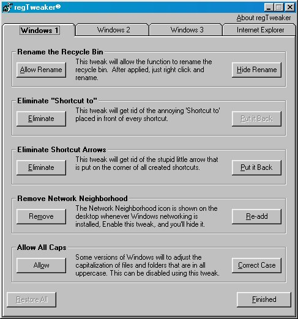



## regTweaker

### Description

This really isn't an update of the program, rather an update of the description. Last one didn't really say what the program does. It is made for Windows 98, however some of the tweaks have been tested and work on 95/NT. It modifies lets you easy modify over 20 registry keys, that improve looks, or rid of annoyances. Check it out and please vote, and leave feedback!
 
### More Info
 

             |
---                |---
**Submitted On**   |2001-09-22 14:24:02
**By**             |[Johneboy](https://github.com/Planet-Source-Code/PSCIndex/blob/master/ByAuthor/johneboy.md)
**Level**          |Beginner
**User Rating**    |4.8 (19 globes from 4 users)
**Compatibility**  |VB 6\.0
**Category**       |[Complete Applications](https://github.com/Planet-Source-Code/PSCIndex/blob/master/ByCategory/complete-applications__1-27.md)
**World**          |[Visual Basic](https://github.com/Planet-Source-Code/PSCIndex/blob/master/ByWorld/visual-basic.md)
**Archive File**   |[regTweaker268029222001\.zip](https://github.com/Planet-Source-Code/johneboy-regtweaker__1-27465/archive/master.zip)

